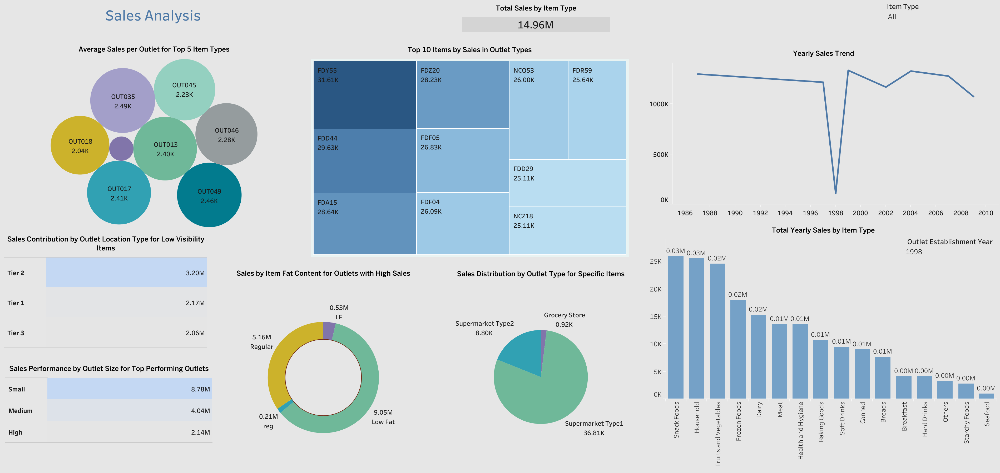

# **Sales Analysis and Optimization**

### **Overview**
This project applies data-driven techniques to analyze and optimize sales across multiple retail stores. By identifying key factors affecting sales performance, we developed actionable insights and provided strategies to enhance revenue and improve overall store efficiency. The project covers the entire data lifecycle, including data cleaning, exploratory data analysis (EDA), machine learning model building, and the generation of actionable insights based on data analysis.

## project steps

- **Data Cleaning and Preprocessing**: Processed and prepared raw sales data by handling missing values, correcting inconsistencies, and transforming categorical data, ensuring high data quality for further analysis.
  
- **Exploratory Data Analysis (EDA):** Uncovered patterns, trends, and relationships in the data to identify the factors driving sales performance, such as pricing strategies, store locations, and product categories.

- **Statistical Analysis and Hypothesis Testing**: Performed statistical tests to validate assumptions and uncover significant factors that influence sales, providing a solid foundation for data-driven decisions.
- **Machine Learning Model**: Implemented a Random Forest model to predict store sales, leveraging feature importance analysis to identify the most impactful factors influencing sales performance.

- **Actionable Insights and Strategic Recommendations**: Derived key insights from the data and provided strategic recommendations to optimize store performance, improving decision-making and focusing resources where they matter most. [here](documents/Data_driven_solution/Insights.md).

- **Sales Dashboard**: Developed a dashboard to visualize key performance indicators (KPIs) and sales trends in a user-friendly format, enabling stakeholders to make data-driven decisions

   ## Contact
If you have any questions or would like to discuss this project further, feel free to reach out!
* [LinkedIn](https://www.linkedin.com/in/hadeel-als) 
* [Email](alsadonhadeel@gmail.com) 
